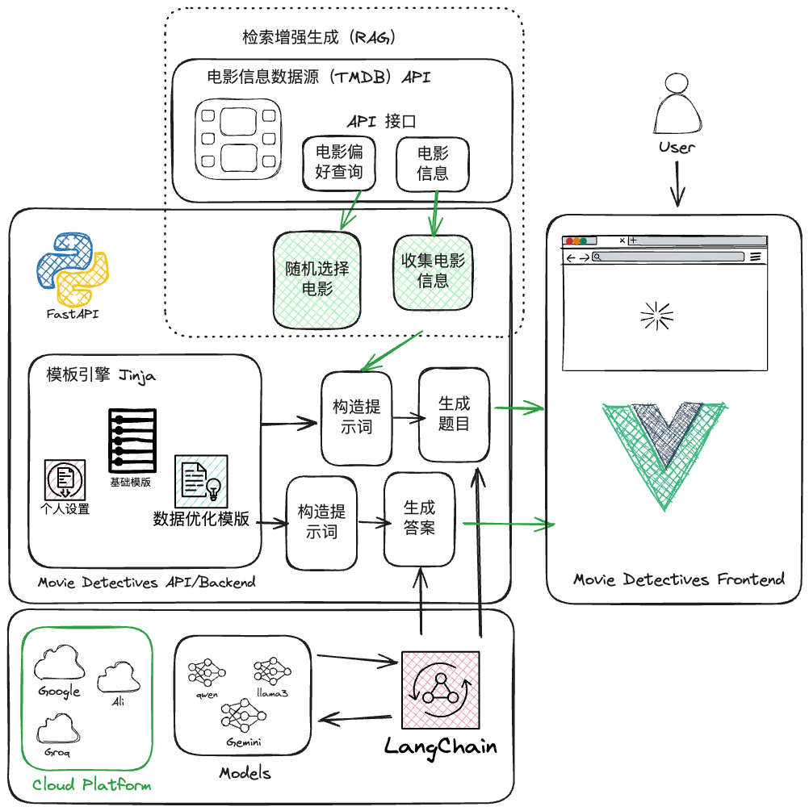
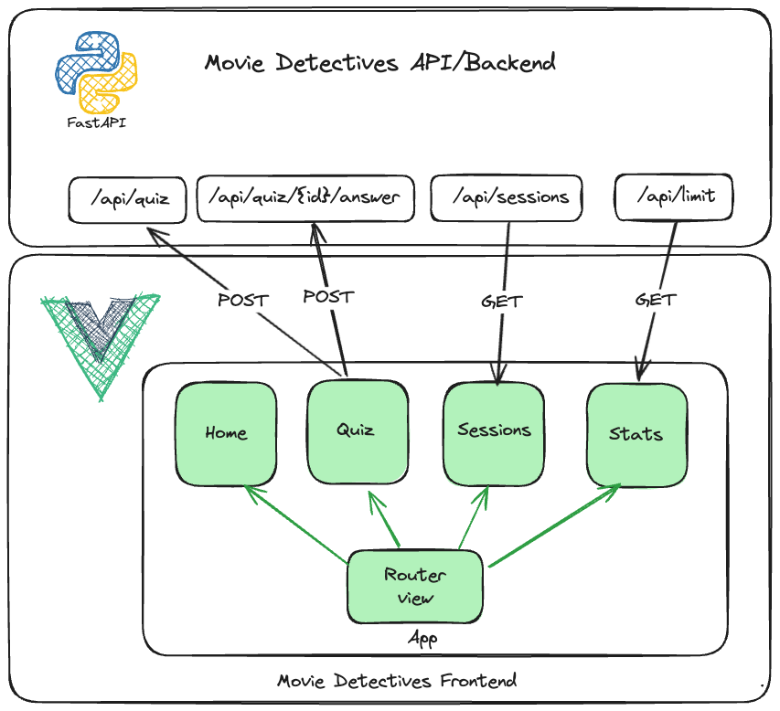

# 骆驼电影侦探 UI


《骆驼电影侦探》是一个项目，它的目标是通过利用 Llama3 模型强大功能，结合来自 The Movie Database (TMDB) 的最新电影资料，打造一个引人入胜的问答游戏。  
  
立即体验：[movie.qianniu.city](https://movie.qianniu.city/)  
  
## 后端技术  
  
项目的后端是用 FastAPI 和 Python 构建的，它采用了检索增强生成（RAG）技术，这种技术可以利用实时的元数据来丰富用户的查询。通过使用 Jinja 模板技术，我们把生成问题的过程分解成了几个模块：基础、个性化以及数据增强，这让我们能够创造出既精准又有趣的问答题目。  
  
## 前端技术  
  
前端则是由 Vue 3 和 Vite 提供动力，daisyUI 和 Tailwind CSS 的支持让前端开发变得更加高效。这些工具的结合，为用户提供了一个简洁、现代的操作界面，使得用户能够无缝地与后端进行交互。  
  
## 总结  
  
在《骆驼电影侦探》中，问答的答案将再次由大语言模型（LLM）进行解读，这使得游戏能够实现动态评分和提供个性化的反馈。这一点展示了在游戏设计与开发中，将大语言模型与检索增强生成技术结合起来的巨大潜力，为创造真正个性化的游戏体验铺平了道路。此外，它还证明了通过引入大语言模型来创造有趣的问答游戏或教育游戏是完全可行的。只需添加或修改几个 Jinja 模板模块，就能轻松改变游戏的个性或语言设置，极大地简化了开发者的工作。现在就来尝试一下，看看改变问答游戏中 AI 的个性会带来怎样的全新体验吧。 


Backend: [movie-detectives-server](https://github.com/qianniucity/movie-detectives-server)

## 项目概述

- VueJS 3.4
- Vite


*Movie Detectives - System Overview*


## 组件

《骆驼电影侦探》的前端界面主要由四个部分构成，并通过 vue-router 实现这些部分之间的切换。  
  
### 首页  
  
首页简单地展示了欢迎信息。  
  
### 测验  
  
测验部分直接展现了游戏的测验环节，并通过 `fetch` 与后端的 API 进行通信。为了设置一个测验，它会向 `api/quiz` 发送一个带有用户所选设置的 POST 请求。接下来，后端会根据用户的选择挑选一部随机电影，并利用模块化的提示生成器来构建问题提示，通过 Llama3 生成问题和提示，最后将所有这些信息回传给前端组件，从而使测验可以被展现出来。  
  
此外，每个测验在后端都会被分配一个会话 ID，并被保存在一个有大小限制的最近最少使用（LRU）缓存中。  
  
### 会话  
  
为了便于调试，这个部分会从 `api/sessions` 端点拉取数据。它会显示出缓存中所有处于**活跃**状态的会话。  
  
### 统计  
  
这一部分用于展示有关服务的统计数据。但是，目前只展示了一种统计数据，即测验的次数限制。为了控制访问流量，我们设定了每天测验会话的上限，这个限制会在第二天的第一个测验时重置。相关数据通过访问 `api/limit` 端点获得。  


*骆驼电影侦探 - Vue Components*

## 项目设定

确保在 `src/config.js` 中为本地或实时使用配置正确的 API 端点。

```sh
npm install
```

## 项目运行

```sh
npm run dev
```

## 项目构建

```sh
npm run build
```
